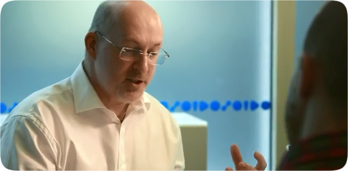

    

I'm a software developer based in London and Sevenoaks, where I'm currently creating iOS apps with Swift.
I have over 30 years experience in the industry with many different technologies and roles.

Contact me for availability for iOS app development projects and contracts.

	
    
	
	

## Recent App Store Projects
[Writerly](https://russell-archer.github.io/Writerly/) 
**Private repo**. Public documentation available. 
*The creative writing app designed to help spark your ideas into life.*

Writerly is a creative writing

    

[Retreev](https://russell-archer.github.io/Retreev/) 
**Private repo**. Public documentation available. 
*When you really need a ride home.*

    

## Recent Projects

[Sign in with Apple](https://github.com/russell-archer/AppleSignInDemo) 
How to use the new Sign in with Apple service in a UIKit and iOS 13 app.

[Speech Dictation Demo](https://github.com/russell-archer/SpeechDictationDemo) 
An iOS speech recognition demo that transcribes live speech.

[Dark Mode. Updating an existing App Store app](https://github.com/russell-archer/DarkModeDemo-UIKit) 
Preparing for iOS 13 Dark Mode.

[iOS 13 Modal Styles Demo](https://github.com/russell-archer/ModalStylesDemo) 
Exploring the differences between presentViewController and pushViewController with new iOS 13 modal presentation styles.

[Context Menu Demo](https://github.com/russell-archer/ContextMenuDemo) 
How to display a context menu in iOS 13.

[Image API Alamofire](https://github.com/russell-archer/ImageApiAlamofire) 
Alamofire Pixabay Image API Demo with Swift Package Manager.

[SwiftUI and Combine Notifications](https://github.com/russell-archer/SwiftUI-Combine-NotificationDemo) 
Using SwiftUI and Combine extensions to NotificationCenter.

[SwiftUI Hosting UIKit Views](https://github.com/russell-archer/SwiftUI-SwiftUIHostingUIKit) 
How to use UIKit UIView and UIViewController in SwiftUI.

[Hosting SwiftUI Views in UIKit](https://github.com/russell-archer/SwiftUI-UIKitHostingSwiftUI) 
Using UIHostingController to display a SwiftUI View in a UIKit app.

[SwiftUI State](https://github.com/russell-archer/SwiftUI-StateDemo) 
Using state and binding to create a UI that responds to user input to modify internal state.

[SwiftUI Navigation Bar](https://github.com/russell-archer/SwiftUI-NavBarDemo) 
How to select either large navigation bar (the default) or a small, inline bar.

[SwiftUI List](https://github.com/russell-archer/SwiftUI-ListDemo) 
Creating an editable list with SwiftUI with support for navigation.

[SwiftUI Image API](https://github.com/russell-archer/SwiftUI-ImageAPIDemo) 
Using SwiftUI to consume REST API with image data.

[SwiftUI Alert](https://github.com/russell-archer/SwiftUI-AlertDemo) 
Using SwiftUI to display alerts, actionsheets and popovers.

[Hangman Game](https://github.com/russell-archer/Hangman) 
Simple, non-graphical Hangman game.

[Siri Shortcuts. Show Random Color Demo](https://github.com/russell-archer/ShowRandomColor) 
Demo of Siri shortcuts for iOS 12 using Intents.

[Siri Shortcuts. PicSearch](https://github.com/russell-archer/PicSearch) 
Demo of Siri shortcuts for iOS 12 using NSUserActivity.

[Pixabay Image API Demo](https://github.com/russell-archer/ImageApiDemo) 
App that requests image data using the Pixabay API.

[Cal Demo](https://github.com/russell-archer/CalDemo) 
Demo for getting events from iOS calendars.
