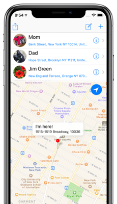

I'm a software developer based in London and Sevenoaks, UK, where I'm currently creating iOS apps with Swift.
I have over 30 years experience in the industry in many different roles and with a range of technologies.

    

    <strong>Contact me for availability for iOS app development projects and contracts</strong>

	
    
	
	

<h1 align="center">Recent App Store Projects</h1>

&nbsp;

    

<h2 align="center">
    <a href="https://russell-archer.github.io/Writerly/">Writerly</a>
</h2>

    
    
    
    
    
    

<h3 align="center">
    <a href="https://russell-archer.github.io/Writerly/">Inspiration for Writers</a>
</h3>

**Writerly** is an iOS app designed to help users improve their creative writing through a series of tried-and-tested techniques, tools
and exercises. It includes the ability to create random *characters*, *moods*, *scenarios*, *locations*, writing *prompts*, etc.

I developed the app in cooperation with an award-winning creative writing tutor and author.

    

In-app purchases allow the user to add functionality related to specific creative writing concepts, such as character development.
However, the app has been designed to provide real benefits to the user without cost. The free app isn't merely a vehicle for in-app
purchases.

    

Technically, the main features of the app are:

* Developed in ***Swift*** (currently ***Swift 5***)
* A ***UISplitViewController*** allows selection of topic in the left (master) pane, with the a page of content shown in the right (detail) pane
* Content is broken into *modules*, *topics*, *sub-topics* and *pages*, with the entire structure of the app's content defined as a dictionary in a ***.plist*** file, allowing for easy changes and additions
* Navigation between *pages* uses a ***UISwipeGestureRecognizer*** to support swipe-left to advance to the next topic and swipe-right to go to the previous topic
* Many exercises are timed and ***notifications*** are used to alert the user when their time is up
* To enable easy changes and additions, text content is defined through ***HTML/Javascript*** and hosted in a ***WKWebView***
* Two-way message interop between the iOS core of the app and Javascript uses ***WebKit***'s ability to evaluate JavaScript statements and handle messages from Javascript (***WKScriptMessageHandler***)
* In-app purchases are made and restored using ***StoreKit*** and receipts validated using ***OpenSSL***
* The app keeps track of completed exercises and syncs app state via *NSUbiquitousKeyValueStore* **iCloud key-value storage**
* Analytics are handled via ***Fabric Crashlytics*** and ***Fabric Answers*** (recently transitioned to ***Google Firebase***)

    
    
    

    

<h2 align="center">
    <a href="https://russell-archer.github.io/Retreev/">Retreev</a>
</h2>

    
    
    
    
      

<h3 align="center">
    <a href="https://russell-archer.github.io/Retreev/">When you really need a ride home</a>
</h3>

**Retreev** was developed in reponse to a simple, but common problem: how to *quickly and easily* request a ride home from a parent or friend
and let them know exactly where you are!

The app displays a map showing the user their current location and postal address. Tapping a contact zooms the map to show the
location of both the user and the contact (sounds easy, but this was *tricky*!), as well as the distance between them.
Tapping the "retreev" button generates an SMS message that includes a predefined (editable) message, the user's current
location address and an *annotated* map showing the location and distance.

    

Technically, the main features of the app are:

* Developed in ***Swift*** (currently ***Swift 5***)
* Uses the ***Contacts*** framework to import user-selected contact details
* Uses ***CoreLocation*** to ***Geocode*** (get lat/long from an address) and ***Reverse Geocode*** (get address from lat/long)
* Creates a custom bitmap graphics context to ***capture a map snapshot*** and ***annotate*** it with address info, etc.
* Supports ***sharing*** with WhatsApp, email, etc.
* Uses the ***MessageUI*** framework to send SMS messages

    
    
    

<h2 align="center">Recent Projects</h2>

[Sign in with Apple](https://github.com/russell-archer/AppleSignInDemo) 
How to use the new Sign in with Apple service in a UIKit and iOS 13 app.

[Speech Dictation Demo](https://github.com/russell-archer/SpeechDictationDemo) 
An iOS speech recognition demo that transcribes live speech.

[Dark Mode. Updating an existing App Store app](https://github.com/russell-archer/DarkModeDemo-UIKit) 
Preparing for iOS 13 Dark Mode.

[iOS 13 Modal Styles Demo](https://github.com/russell-archer/ModalStylesDemo) 
Exploring the differences between presentViewController and pushViewController with new iOS 13 modal presentation styles.

[Context Menu Demo](https://github.com/russell-archer/ContextMenuDemo) 
How to display a context menu in iOS 13.

[Image API Alamofire](https://github.com/russell-archer/ImageApiAlamofire) 
Alamofire Pixabay Image API Demo with Swift Package Manager.

[SwiftUI and Combine Notifications](https://github.com/russell-archer/SwiftUI-Combine-NotificationDemo) 
Using SwiftUI and Combine extensions to NotificationCenter.

[SwiftUI Hosting UIKit Views](https://github.com/russell-archer/SwiftUI-SwiftUIHostingUIKit) 
How to use UIKit UIView and UIViewController in SwiftUI.

[Hosting SwiftUI Views in UIKit](https://github.com/russell-archer/SwiftUI-UIKitHostingSwiftUI) 
Using UIHostingController to display a SwiftUI View in a UIKit app.

[SwiftUI State](https://github.com/russell-archer/SwiftUI-StateDemo) 
Using state and binding to create a UI that responds to user input to modify internal state.

[SwiftUI Navigation Bar](https://github.com/russell-archer/SwiftUI-NavBarDemo) 
How to select either large navigation bar (the default) or a small, inline bar.

[SwiftUI List](https://github.com/russell-archer/SwiftUI-ListDemo) 
Creating an editable list with SwiftUI with support for navigation.

[SwiftUI Image API](https://github.com/russell-archer/SwiftUI-ImageAPIDemo) 
Using SwiftUI to consume REST API with image data.

[SwiftUI Alert](https://github.com/russell-archer/SwiftUI-AlertDemo) 
Using SwiftUI to display alerts, actionsheets and popovers.

[Hangman Game](https://github.com/russell-archer/Hangman) 
Simple, non-graphical Hangman game.

[Siri Shortcuts. Show Random Color Demo](https://github.com/russell-archer/ShowRandomColor) 
Demo of Siri shortcuts for iOS 12 using Intents.

[Siri Shortcuts. PicSearch](https://github.com/russell-archer/PicSearch) 
Demo of Siri shortcuts for iOS 12 using NSUserActivity.

[Pixabay Image API Demo](https://github.com/russell-archer/ImageApiDemo) 
App that requests image data using the Pixabay API.

[Cal Demo](https://github.com/russell-archer/CalDemo) 
Demo for getting events from iOS calendars.
